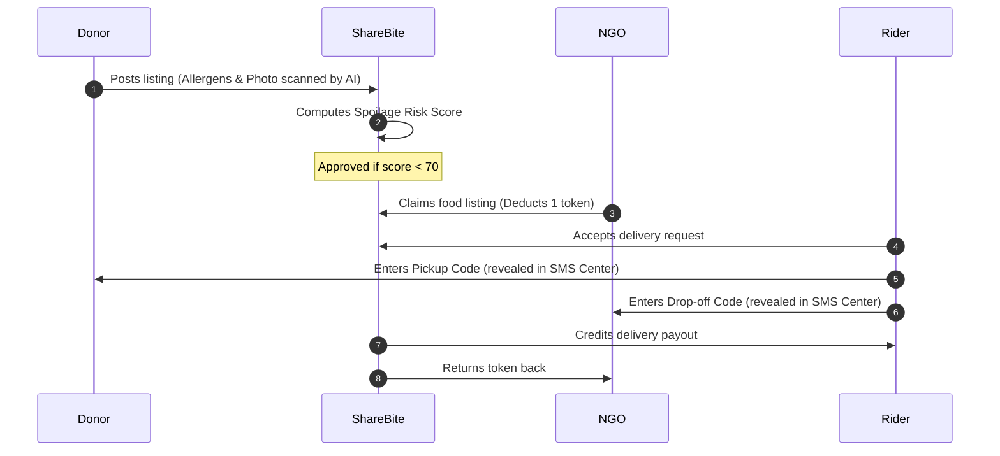

# <p align="center">🥗 ShareBite</p>

<p align="center">
  <strong>Safe Food. Shared Dignity. Zero Waste.</strong>
</p>

<p align="center">
  
  
  
  
  
  
</p>

<p align="center">
  A technology-enabled, dignity-first logistics and redistribution framework bridging the gap between B2B commercial surplus kitchens, riders, and vulnerable communities.
</p>

---

## 🎨 Design System & Visual Identity
ShareBite inherits the visual identity of **Savor & Soul (Epistemic Luxury)**:
*   **Typography**: Bodoni Moda (Titles), Hanken Grotesk (Copy), Space Mono (Monospaced details).
*   **Palette**: Dark luxury theme (Obsidian background `#131313`, Gold accents `#f2ca50`, Mint Green status `#88d982`, and Glassmorphism details).
*   **Geometry**: Organic curved containers (`border-radius: 32px` organic corners).

---

## 🚀 Key Features

### 🛡️ Spoilage Risk Scoring Gate
A real-time safety risk rating index (0-100) calculated dynamically.
*   **Low Risk (<40)**: Auto-approved for redistribution.
*   **Medium Risk (40-69)**: Restricts pickup to a 2-hour window.
*   **High Risk (≥70)**: Automatically blocked by the safety gate.

### 🤖 RAG AI Assistant with Toxicity Guardrails
*   A sliding chat drawer utilizing an index of platform guidelines.
*   Answers queries regarding storage temperatures, allergens, and token policies.
*   **Content Safety Guard**: Intercepts toxic/abusive inputs instantly.

### 📱 Simulated Virtual Phone Center
*   A simulated smartphone sidebar tracking live carrier SMS alerts.
*   Presents verification OTPs, pickup keys, and delivery codes.

### 🌱 Environmental ESG Carbon Offsetting
*   Calculate savings in real-time. Each portion redirected saves:
    *   **2.5 kg of CO₂ equivalent** avoided.
    *   **1000 Liters of fresh water** conserved.
*   Includes automated B2B Corporate Social Responsibility (CSR) certificate printing.

---

## 🛠️ Tech Stack & Dependencies

| Layer | Technology | Details |
| :--- | :--- | :--- |
| **Frontend** | React, Vite | Ultra-fast SPA compilation |
| **Animation** | GSAP, ScrollTrigger | Dynamic scroll and staggered loading |
| **Scroll** | Lenis Scroll | Inertial wheel scroll curves |
| **Backend** | Node.js, Express | RESTful API server routing |
| **Database** | Lowdb | Local JSON database schema |

---

## 📐 Spoilage Scoring Formula

$$\text{Score} = \text{Preparation Age Weight} + \text{Ambient Temp Penalty} + \text{Category Weight} + \text{Packaging Penalty}$$

### Penalty Weights breakdown:
*   **Prep Age**: $+8$ points per hour since preparation (max $40$ pts).
*   **Ambient Temperature**:
    *   $>25^\circ\text{C}$: $+5$ pts
    *   $>30^\circ\text{C}$: $+15$ pts
    *   $>35^\circ\text{C}$: $+25$ pts
*   **Food Category**: Dry ($+3$), Cooked ($+12$), Liquid/Dairy ($+20$).
*   **Packaging Status**: Sealed ($+0$), Closed ($+10$), Open tray ($+25$).

---

## ⚙️ How It Works (Logistics Flow)



---

## 🚀 Quick Start Setup

> [!IMPORTANT]
> Both the client and API server boot simultaneously via a single launcher script.

1.  Clone this repository to your local drive.
2.  Launch the environment:
    ```powershell
    ./start-dev.bat
    ```
3.  Navigate your browser to:
    *   **Client**: [http://localhost:5173](http://localhost:5173)
    *   **Backend API**: [http://localhost:5000](http://localhost:5000)

---

## 📂 Core File References

- **Local database ledger**: [backend/data/db.json](file:///E:/MY%20PROJECTS/backend/data/db.json)
- **Active SMS OTP ledger**: [backend/data/otps.json](file:///E:/MY%20PROJECTS/backend/data/otps.json)
- **React App logic container**: [frontend/src/App.jsx](file:///E:/MY%20PROJECTS/frontend/src/App.jsx)
- **Savor & Soul CSS Stylesheet**: [frontend/src/index.css](file:///E:/MY%20PROJECTS/frontend/src/index.css)
